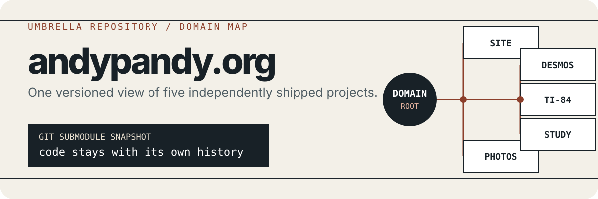

<p align="center">
  
</p>

<p align="center">
  <a href="https://andypandy.org"><strong>Visit andypandy.org</strong></a>
  ·
  <a href="https://github.com/ChinesePrince07">GitHub profile</a>
</p>

## The map behind the domain

This is the umbrella repository for the projects deployed across
`andypandy.org`. It pins each component as a Git submodule, giving the site,
photo archive, hardware work, and school tools one versioned map without folding
their histories into a single monorepo.

| Path | Project | Destination | Role |
| --- | --- | --- | --- |
| `site/` | [andypandy-site](https://github.com/ChinesePrince07/andypandy-site) | [andypandy.org](https://andypandy.org) | Personal site, projects, blog, photos, travel, and apps |
| `photos/` | [andypandy-photos](https://github.com/ChinesePrince07/andypandy-photos) | [pics.andypandy.org](https://pics.andypandy.org) | Self-hosted Afilmory gallery and 3D photo museum |
| `desmos/` | [DesmosBezierRenderer-mac](https://github.com/ChinesePrince07/DesmosBezierRenderer-mac) | [desmos.andypandy.org](https://desmos.andypandy.org) | Image-to-Bézier-curve art for Desmos |
| `ti84/` | [TI-84-GPT-HACK](https://github.com/ChinesePrince07/TI-84-GPT-HACK) | [api.andypandy.org](https://api.andypandy.org) | TI-84 Wi-Fi/GPT hardware mod and supporting API |
| `suffield-drive/` | [andypandy-suffield-drive](https://github.com/ChinesePrince07/andypandy-suffield-drive) | [study.andypandy.org](https://study.andypandy.org) | Shared school-resource drive |

The component repositories are the source of truth for their own code,
documentation, issues, and deployments. This repository records which commit of
each component belongs to the umbrella at a given point in time.

## Clone the complete workspace

```bash
git clone --recurse-submodules https://github.com/ChinesePrince07/andypandy.git
cd andypandy
```

If you already cloned without submodules:

```bash
git submodule update --init --recursive
```

To bring checked-out submodules to the commits currently recorded here:

```bash
git submodule sync --recursive
git submodule update --init --recursive
```

## Working on a component

Enter the component directory and follow that repository's README:

```bash
cd site
npm install
npm run dev
```

After a component change is merged or pushed in its own repository, update the
corresponding submodule pointer here:

```bash
cd site
git pull --ff-only
cd ..
git add site
git commit -m "chore: bump site submodule"
```

Commit code changes in the component repository first. A submodule-pointer commit
here should only record the already-published component revision.

## Deployment boundary

This umbrella repository does not provide one root build. Each component owns its
runtime, configuration, and deployment:

```text
andypandy.org
├── site       Next.js application
├── photos     Afilmory + Next.js + Three.js
├── desmos     Browser-based image-to-curve tool
├── ti84       Embedded project + API service
└── study      Student resource-sharing application
```

That separation keeps credentials, build systems, and release cadence local to
the project that needs them while preserving one inspectable snapshot of the
whole domain.
